# Muhammet Oğuzhan Dede

<picture>
  <source media="(prefers-color-scheme: dark)" srcset="./dark.svg">
  <source media="(prefers-color-scheme: light)" srcset="./light.svg">
  
</picture>

## Backend Software Developer

I design and build scalable backend systems with **.NET**, distributed architectures, and pragmatic AI/LLM integrations.

My work focuses on production-ready software: clear boundaries, reliable data flows, measurable performance, and maintainable architecture. I can work across the full stack when needed, but my strongest focus is backend engineering and system design.

---

## What I Build

- **Enterprise backends** with ASP.NET Core, SQL Server, PostgreSQL, Redis, and RabbitMQ
- **Distributed systems** with explicit service boundaries, async messaging, and resilient workflows
- **AI-powered products** that connect LLM capabilities with real business use cases
- **Full-stack platforms** where backend architecture, frontend delivery, and data flow stay aligned
- **Production foundations** that prioritize maintainability, observability, and long-term ownership

---

## Core Engineering Stack

| Area | Technologies |
| --- | --- |
| Backend | C#, .NET 8, ASP.NET Core, Web API |
| Architecture | Clean Architecture, CQRS, DDD, Microservices |
| Data | SQL Server, PostgreSQL, Entity Framework Core, Dapper |
| Messaging & Cache | RabbitMQ, Redis, async workers |
| Frontend | React, Next.js, TypeScript |
| AI / LLM | Python, LLM integrations, RAG, Ollama |
| Infrastructure | Docker, Linux, multi-service environments |

---

## Current Focus

- Building scalable enterprise platforms with clean backend foundations
- Designing distributed systems that are understandable under real operational pressure
- Connecting .NET backends with Python services and AI/LLM workflows
- Turning LLM features into practical, testable, product-level capabilities
- Improving system design, performance, and maintainability through measured decisions

---

## Featured Projects

### SwarmGrid

[github.com/oguzhandede/SwarmGrid](https://github.com/oguzhandede/SwarmGrid)

A system for collecting physical-space data, processing it through analytical services, and turning it into actionable insights.

**Engineering scope**

- Camera and stream-oriented data ingestion
- Python-based analytics services
- .NET backend coordination layer
- Microservice-oriented architecture
- Real-time and historical analysis scenarios
- AI-assisted decision support patterns

**Why it matters**

SwarmGrid represents the kind of system I like to build: backend-heavy, data-driven, distributed, and connected to real-world operational problems.

---

### Kayra Export

[github.com/oguzhandede/Kayra-Export](https://github.com/oguzhandede/Kayra-Export)

An enterprise-oriented backend system designed around business workflows, maintainable architecture, and extensible service design.

**Engineering scope**

- ASP.NET Core Web API
- Clean Architecture structure
- CQRS and layered design
- Performance-oriented data access
- Business-focused domain modeling
- Extensible backend service boundaries

**Why it matters**

Kayra Export reflects my approach to enterprise software: keep the architecture disciplined, model business behavior clearly, and avoid unnecessary complexity.

---

## Engineering Principles

- Architecture should reduce ambiguity, not add ceremony.
- Microservices need clear ownership, explicit contracts, and observable communication.
- Performance work should start with measurement, not assumptions.
- Backend systems should be designed together with data, frontend, and operational constraints.
- Code that cannot be understood under pressure is not production-ready.

---

## Profile Snapshot

- **Location:** Istanbul, Türkiye
- **Role:** Backend Software Developer
- **Focus:** .NET, distributed systems, full-stack delivery, AI/LLM engineering
- **Portfolio:** [pinner.com.tr](https://pinner.com.tr)
- **Email:** [moguzhandede@gmail.com](mailto:moguzhandede@gmail.com)

---

## Connect

- GitHub: [github.com/oguzhandede](https://github.com/oguzhandede)
- LinkedIn: [linkedin.com/in/oguzdede](https://www.linkedin.com/in/oguzdede)
- Portfolio: [pinner.com.tr](https://pinner.com.tr)
- Email: [moguzhandede@gmail.com](mailto:moguzhandede@gmail.com)
